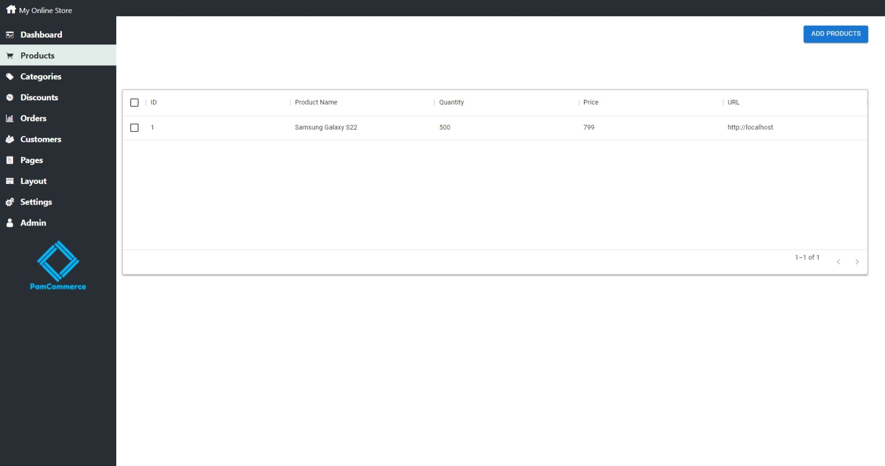
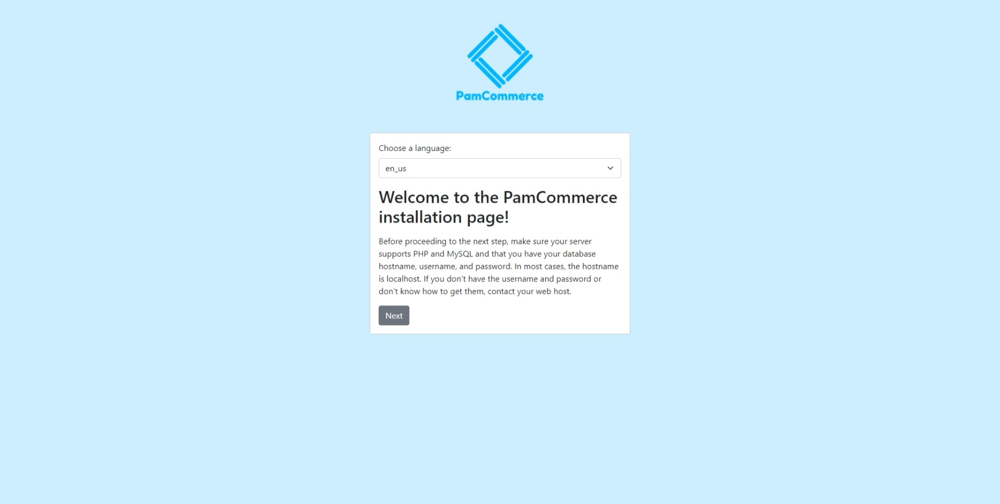
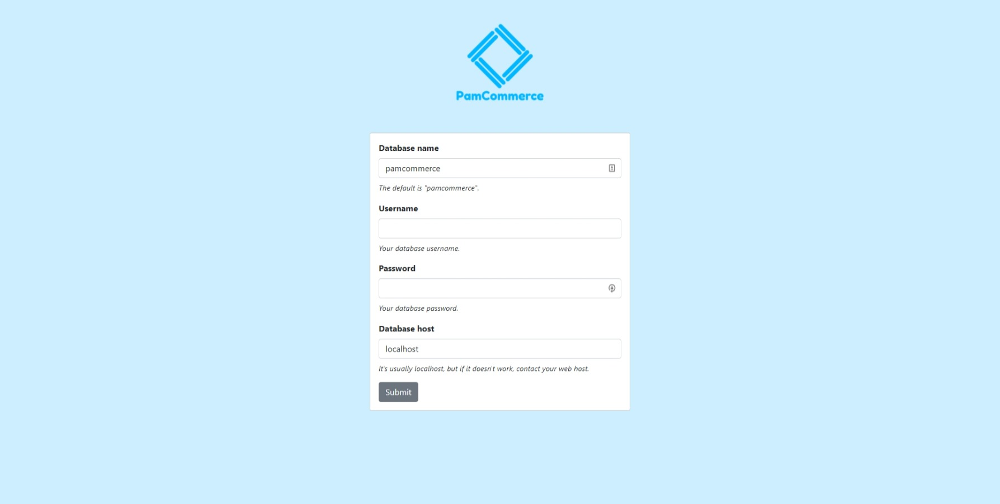

# PamCommerce (under development)

Hi everyone. I'm developing an e-commerce platform with ReactJS, PHP, and MySQL. My focus is on performance and usability, and that's why I chose the React framework, and I'm carefully thinking about what features should be implemented, so it doesn't become a bloated platform. It's currently under development, as I'm still working on the admin panel, but you can check the progress here on this repo.

# Screenshots

